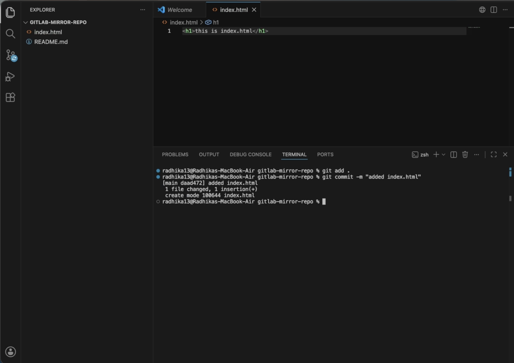
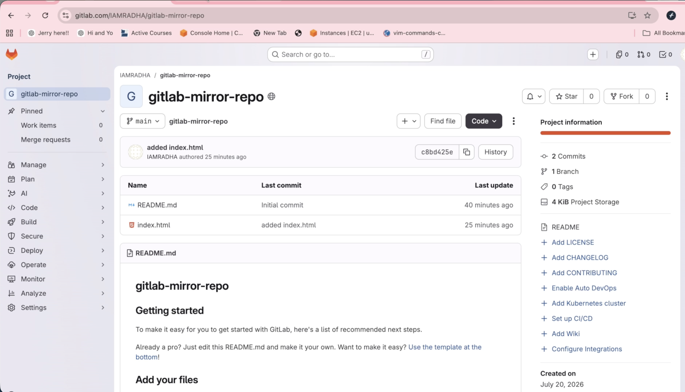
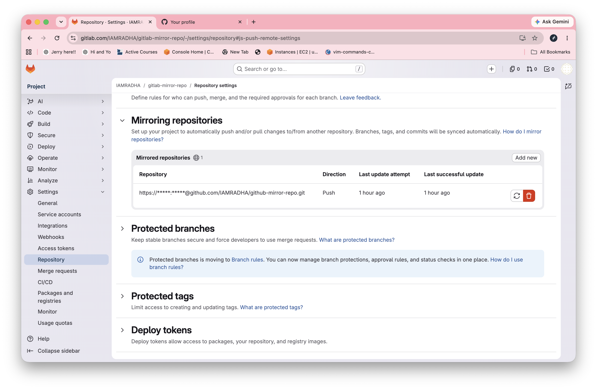
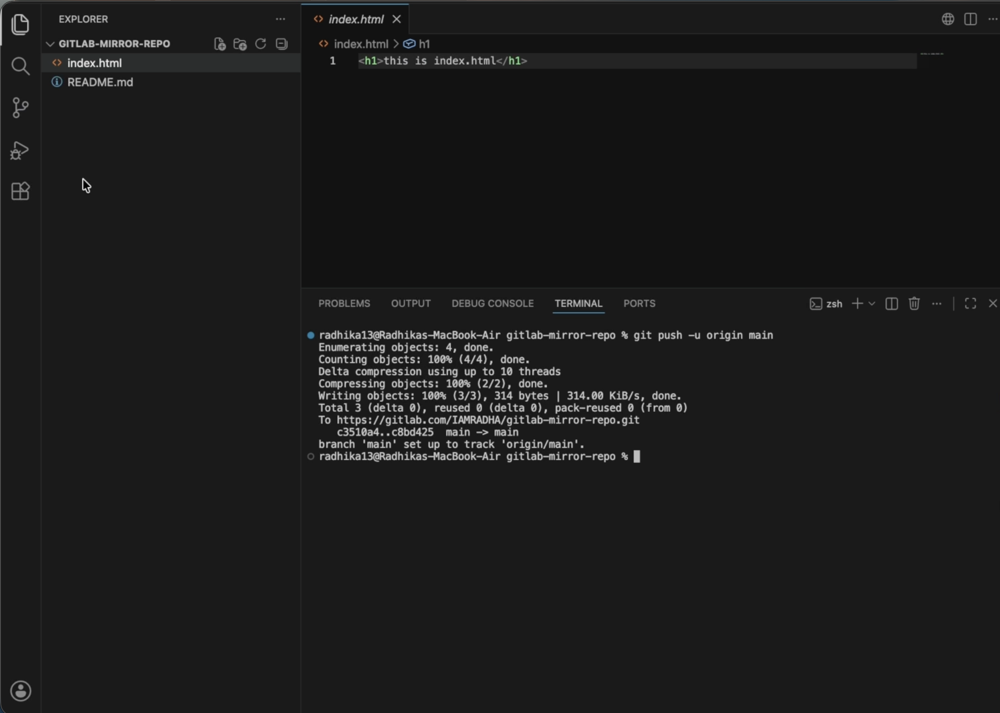

# GitLab to GitHub Repository Mirroring

## Project Overview

This project demonstrates how to automatically mirror a GitLab repository to GitHub using GitLab Repository Mirroring.

Whenever code is pushed to the GitLab repository, GitLab automatically synchronizes the latest changes to the GitHub repository using HTTPS authentication and a GitHub Personal Access Token (PAT).

---

## Architecture

```text
Developer
    │
    ▼
Local Git Repository
    │
    │ git push origin main
    ▼
GitLab Repository
    │
    │ Repository Mirroring
    │ (HTTPS + GitHub PAT)
    ▼
GitHub Repository
```

---

## Technologies Used

- Git
- GitLab
- GitHub
- HTTPS Authentication
- GitHub Personal Access Token (PAT)
- Repository Mirroring

---

## Prerequisites

- Git installed
- GitLab account
- GitHub account
- GitHub Personal Access Token
- Internet connection

---

## Project Structure

```
gitlab-mirror-repo/
│
├── screenshots/
│   ├── vscode.png
│   ├── gitlab-home.png
│   ├── mirror-settings.png
│   ├── github-home.png
│   └── git-push.png
│
├── README.md
└── index.html
```

---

# Project Screenshots

## 1. VS Code Project



---

## 2. GitLab Repository



---

## 3. Repository Mirroring Settings



---

## 4. GitHub Repository


---

## 5. Git Push



---

## Steps Performed

### Step 1

Created a new repository in GitLab.

### Step 2

Cloned the repository.

```bash
git clone <repository-url>
```

### Step 3

Created project files.

```
README.md
index.html
```

### Step 4

Committed the project.

```bash
git add .
git commit -m "Initial Commit"
```

### Step 5

Pushed the project.

```bash
git push origin main
```

### Step 6

Created a GitHub repository.

### Step 7

Generated a GitHub Personal Access Token (PAT).

### Step 8

Configured Repository Mirroring in GitLab.

### Step 9

Verified automatic synchronization from GitLab to GitHub.

---

## Result

- Successfully configured GitLab Repository Mirroring.
- Code pushed to GitLab is automatically synchronized to GitHub.
- Authentication is performed securely using HTTPS and a GitHub Personal Access Token.

---

## Commands Used

```bash
git init

git clone <repository-url>

git status

git add .

git commit -m "Initial Commit"

git push origin main

git log

git remote -v
```

---

## Author

**Radhika**

DevOps Learning Project